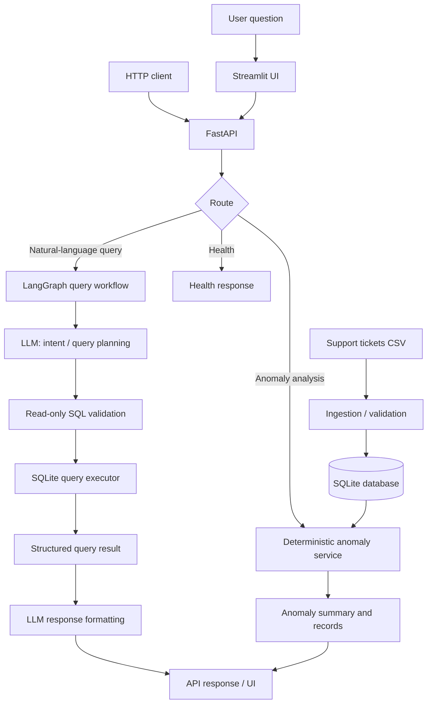

# DOTMappers IT — AI Engineer Assessment

An AI-assisted customer-support analytics application that makes support-ticket data queryable through natural-language questions and identifies operational anomalies. The system combines a deterministic data/query layer with an LLM-powered interpretation layer, a REST API, and a Streamlit interface.

> **Assessment context:** This repository is intended to address the DOTMappers IT AI Engineer assessment: ingest the supplied CSV, answer natural-language questions, detect anomalies, and expose the functionality through an API and UI.

---

## Table of Contents

- [Capabilities](#capabilities)
- [Architecture](#architecture)
- [Request and data flows](#request-and-data-flows)
- [Technology stack](#technology-stack)
- [Dataset](#dataset)
- [Repository layout](#repository-layout)
- [Prerequisites](#prerequisites)
- [Local setup](#local-setup)
- [Configuration and LLMs](#configuration-and-llms)
- [Running the application](#running-the-application)
- [API overview](#api-overview)
- [Natural-language query examples](#natural-language-query-examples)
- [Anomaly detection](#anomaly-detection)
- [Validation, security, and reliability](#validation-security-and-reliability)
- [Testing](#testing)
- [Troubleshooting](#troubleshooting)
- [Known limitations and future work](#known-limitations-and-future-work)

---

## Capabilities

- **CSV ingestion:** Load support-ticket records into a queryable SQLite database.
- **Natural-language analytics:** Interpret questions and execute read-only database queries through a LangGraph workflow.
- **Anomaly detection:** Identify unusually long resolution times and aged, unresolved high-priority tickets.
- **REST interface:** Expose application functionality through FastAPI endpoints.
- **Interactive UI:** Explore analytics and anomaly results in Streamlit.
- **Date-aware analysis:** Support explicit date ranges where the corresponding API/UI path is enabled; the dataset's dates should be used rather than assuming that “this week” overlaps the data.
- **Structured outputs:** Return query/anomaly results as data that can be rendered by the UI or summarized by the LLM.

## Architecture



### Component responsibilities

| Component | Responsibility |
|---|---|
| CSV ingestion | Reads the source CSV, validates required fields, normalizes values, and creates/updates the local database. |
| SQLite | Local persistence and analytical query execution. |
| FastAPI routes | Validate request parameters, dispatch to services/workflows, and return JSON responses. |
| LangGraph | Orchestrates natural-language query handling as explicit workflow steps. |
| LLM | Interprets user intent and assists with query planning and/or natural-language presentation. It is not the authority for computed counts or anomaly statistics. |
| SQL validation | Restricts generated SQL to read-only, permitted queries before execution. |
| Query executor | Runs validated SQL against SQLite and returns structured rows/metadata. |
| Anomaly service | Computes statistical outliers and overdue-ticket conditions deterministically. |
| Streamlit | Provides a user-facing interface for asking questions and viewing analytics/anomaly results. |

### Design principles

1. **Deterministic computation for facts:** SQL and Python compute counts, averages, date filtering, and anomaly metrics. The LLM should explain results, not invent them.
2. **Read-only query execution:** Natural-language requests must not be able to mutate or delete database contents.
3. **Separation of concerns:** Routes, workflow orchestration, data access, and business logic should remain independently testable.
4. **Local-first operation:** SQLite and a locally run model can support a no-paid-service setup.
5. **Explicit date semantics:** A date-range request should be translated into inclusive start/end boundaries and validated against the dataset's available dates.

## Request and data flows

### 1. Data ingestion

1. The ingestion module locates the configured CSV.
2. It checks required columns and parses timestamps/numeric fields.
3. It creates or populates the SQLite database.
4. API/query services read from the resulting database.

Run the project's ingestion entry point before starting the app if database initialization is not automatically performed by application startup.

### 2. Natural-language analytics

1. A user enters a question in Streamlit or sends it to the query API.
2. The LangGraph workflow receives the question and state.
3. The LLM interprets the request and proposes a structured plan/query.
4. SQL validation rejects unsupported or non-read-only statements.
5. The query executor runs the approved SQL against SQLite.
6. The result is returned as structured data and may be formatted into a concise explanation.
7. The API/UI displays the answer and supporting result rows or aggregates.

### 3. Anomaly analysis

1. The caller supplies an analysis date or date range and any supported threshold.
2. The anomaly service filters the relevant ticket population.
3. Resolution-time outliers are calculated using the configured statistical method (IQR-based bounds in the current implementation described during development).
4. Unresolved high-priority tickets are checked against the overdue-age threshold.
5. The service returns counts, thresholds/bounds, and matching ticket records.

**Important:** “Anomalies in a date range” and “all tickets created up to a reference date” are different populations. The API's selected date parameters determine which interpretation is applied. Confirm the behavior in the current route/service before comparing results.

## Technology stack

| Area | Technology |
|---|---|
| Language | Python |
| API | FastAPI |
| UI | Streamlit |
| Agent/workflow orchestration | LangGraph |
| LLM integration | LangChain-compatible model integration (provider depends on configuration) |
| Database | SQLite |
| Data processing | pandas |
| Validation/testing | pytest |
| Local model option | Ollama |
| Hosted free-tier options | Groq or Hugging Face Inference API, if configured |

The exact package versions should be taken from the repository's `requirements.txt` (or equivalent dependency file). Keep that file as the source of truth.

## Dataset

The assessment brief describes a UTF-8 CSV named `support_tickets.csv` with 500 rows. Its schema includes:

| Field | Meaning |
|---|---|
| `ticket_id` | Unique ticket identifier |
| `created_at` | Ticket creation timestamp |
| `category` | Issue category (e.g. Billing, Technical, General) |
| `priority` | Urgency (Low, Medium, High, Critical) |
| `status` | Ticket state (Open, Resolved, Escalated) |
| `response_time_hrs` | Hours until first response |
| `resolution_time_hrs` | Hours until resolution; null for unresolved tickets |
| `agent_id` | Assigned support agent |
| `customer_rating` | Customer rating (1–5; may be null) |
| `issue_summary` | Short free-text issue description |

The supplied assessment sample shows dates beginning in January 2024. The actual minimum and maximum timestamps should be discovered from the loaded dataset/database at runtime.

## Repository layout

The application is organized around API routes, services, workflow/query execution, and a Streamlit UI. Use the actual directory tree in the repository as authoritative; names below describe the intended responsibilities rather than asserting every filename:

```text
.
├── app/
│   ├── api/
│   │   ├── routes/       # HTTP endpoints
│   │   └── services/     # Query/anomaly business logic
│   ├── ...               # Workflow, data access, and shared modules
│   └── ui/               # Streamlit application
├── data/                 # Source CSV / local data assets (if included)
├── tests/                # pytest tests (if included)
├── requirements.txt
├── .env.example          # Recommended configuration template
└── README.md
```

## Prerequisites

- Python 3.10+ (use the version compatible with the project's pinned dependencies).
- Git.
- An LLM provider:
  - **Ollama** with a compatible model pulled locally, or
  - a supported free-tier hosted provider and its API key.
- The supplied `support_tickets.csv` file, unless it is already included in the repository.

## Local setup

### 1. Clone the repository

```bash
git clone <YOUR_GITHUB_REPOSITORY_URL>
cd <YOUR_REPOSITORY_DIRECTORY>
```

### 2. Create and activate a virtual environment

**Windows PowerShell**
```powershell
python -m venv .venv
.\.venv\Scripts\Activate.ps1
```

**Linux / macOS**
```bash
python3 -m venv .venv
source .venv/bin/activate
```

### 3. Install dependencies

```bash
python -m pip install --upgrade pip
pip install -r requirements.txt
```

### 4. Add the dataset

Place `support_tickets.csv` at the location expected by the ingestion configuration. If the project uses a different data path, update the relevant configuration rather than moving files blindly.

### 5. Configure environment variables

Create a local `.env` file if the application uses one. Do not commit secrets.

Example template (rename keys to match the actual settings read by the code):

```dotenv
# Example only — verify names against the application's configuration.
LLM_PROVIDER=ollama
OLLAMA_BASE_URL=http://localhost:11434
OLLAMA_MODEL=<your-pulled-model>
GROQ_API_KEY=
HF_TOKEN=
```

### 6. Initialize the database

Run the repository's database initialization script/command. The exact module path depends on the checked-out source. For example, if the project exposes `init_db.py` at the repository root:

```bash
python init_db.py
```

If initialization is performed automatically during FastAPI startup, follow that startup path instead and ensure the CSV path is valid.

## Configuration and LLMs

### Provider options

| Provider | When to use | Notes |
|---|---|---|
| Ollama | Local development and offline/private inference | Requires Ollama installed and the selected model pulled. Model size affects RAM/VRAM and latency. |
| Groq | Hosted inference with a free-tier option, subject to provider limits | Requires an API key and network access. |
| Hugging Face Inference API | Hosted inference where a compatible model/endpoint is available | Requires token/configuration; availability and free-tier limits can change. |

Use one configured provider at a time unless the code explicitly implements fallback. A provider name in documentation does not mean fallback is automatically active.

### Selecting a model

Choose a model that:
- follows structured-output instructions reliably;
- understands SQL and the database schema;
- fits the available hardware or provider limits;
- has acceptable latency for an interactive workflow.

The model is used for language understanding/planning and presentation. SQL validation, database execution, and anomaly calculations should remain deterministic.

## Running the application

Run commands from the repository root and use the entry points defined in the current source.

### Start the FastAPI server

Typical command when the ASGI application is exposed as `app.main:app`:

```bash
uvicorn app.main:app --reload
```

If the project uses a different module/object path, substitute the actual import path. Once started, open:

- API base: `http://127.0.0.1:8000`
- Interactive API docs: `http://127.0.0.1:8000/docs`

### Start the Streamlit UI

In a second terminal:

```bash
streamlit run app/ui/streamlit_app.py
```

Use the actual UI file path if it differs. The UI must point to the running API's base URL as configured by the application.

## API overview

The assessment requires at least these capabilities:

| Capability | Purpose |
|---|---|
| Health check | Confirms the API process is responding. |
| Natural-language query | Accepts a user question and returns query results/answer. |
| Anomaly detection | Accepts supported date/threshold parameters and returns detected anomalies. |

Inspect the FastAPI route definitions for the exact paths, HTTP methods, request schemas, and response models. Do not assume endpoint names from this overview.

### Example request shapes

These are illustrative payloads; adapt the URL and parameter names to the actual OpenAPI schema exposed at `/docs`.

**Natural-language query**
```json
{
  "question": "How many tickets are currently open?"
}
```

**Anomaly detection**
```json
{
  "start_date": "2024-03-04",
  "end_date": "2024-03-10",
  "overdue_hours": 24
}
```

If the implementation uses a reference-date parameter such as `as_of`, use the parameter documented by the current endpoint. A date range and an `as_of` date are not interchangeable.

## Natural-language query examples

Questions aligned with the assessment brief include:

| User question | Expected type of result |
|---|---|
| “How many tickets are currently open?” | Count of records whose status is open under the app's status normalization. |
| “Which agent resolved the most tickets this month?” | Agent aggregation over the requested month and resolved-ticket population. |
| “Show me all Critical tickets not resolved within 12 hours.” | Critical tickets meeting the specified resolution/age condition; clarify whether unresolved tickets are included if the question is ambiguous. |
| “What is the average customer rating for Technical category tickets?” | Average non-null rating for the Technical category. |
| “Are there any anomalies in resolution times this week?” | Requires a well-defined week and a date range overlapping the dataset; otherwise the system should explain the mismatch or request a date. |

### Example cURL

```bash
curl -X POST "http://127.0.0.1:8000/<QUERY_ENDPOINT>" \
  -H "Content-Type: application/json" \
  -d '{"question":"How many tickets are currently open?"}'
```

Replace `<QUERY_ENDPOINT>` with the actual path shown in `/docs`.

## Anomaly detection

### Resolution-time outliers

The current development design uses an IQR-style statistical method:

- \(Q_1\): first quartile of valid resolution times.
- \(Q_3\): third quartile.
- \(IQR = Q_3 - Q_1\).
- Lower bound: \(Q_1 - 1.5 \times IQR\).
- Upper bound: \(Q_3 + 1.5 \times IQR\).

Resolution-time values outside the bounds are flagged as statistical outliers. The lower bound can be negative; since resolution durations cannot normally be negative, this is not itself evidence of a negative-duration ticket.

### Overdue unresolved tickets

Unresolved tickets are checked against an age threshold, with priority filtering where configured. The age is calculated relative to the selected reference time/date. The exact priority set and whether the date filter applies to creation date or analysis date must match the service implementation.

### Interpreting results

An anomaly flag is an investigation signal, not proof of a data error or agent fault. Review the ticket, category, priority, and operational context before taking action.

## Validation, security, and reliability

- Validate request bodies, date formats, and threshold ranges at the API boundary.
- Parse LLM output as structured data and handle malformed or incomplete responses.
- Reject SQL that is not read-only; use parameterized values for user-provided filters.
- Keep database access constrained to the intended local database.
- Avoid returning secrets, provider credentials, or unnecessary raw customer text.
- Keep statistical calculations in code rather than asking the LLM to calculate them.
- Provide useful error messages without exposing stack traces to API clients.
- Treat LLM-generated SQL as untrusted input, even when the prompt instructs the model to be safe.

## Testing

Run the test suite from the repository root:

```bash
pytest -q
```

If tests require environment variables or a test database, configure those as described in the test fixtures or project configuration. Add tests for:

- CSV schema validation and missing/null values;
- read-only SQL validation (including multiple statements and mutation attempts);
- empty query results and malformed LLM output;
- date parsing, invalid ranges, and dataset-boundary behavior;
- IQR calculations and unresolved-ticket age thresholds;
- API success/error responses;
- Streamlit/API integration where practical.

## Troubleshooting

| Symptom | Checks |
|---|---|
| Database is empty or missing | Confirm the ingestion/init command ran, the CSV path is correct, and the app is using the same SQLite file. |
| LLM connection fails | Confirm provider configuration, local Ollama service/model availability, API key, and network access. |
| Query is rejected | Inspect the generated SQL and validator message; ensure it is read-only and uses valid table/column names. |
| Natural-language date phrase is not understood | Use explicit ISO dates (`YYYY-MM-DD`) and check whether the current parser supports the requested range syntax. |
| “This week” returns no relevant records | Compare the interpreted date window with the dataset's actual minimum/maximum timestamps. |
| UI cannot reach API | Start FastAPI first and verify the configured API base URL/port. |
| Dependency installation fails | Use a compatible Python version and install from the repository's pinned dependency file. |

## Known limitations and future work

Confirm these against the current implementation before submission; they are common areas to document or improve:

- Natural-language date expressions can be ambiguous and may require explicit dates.
- Statistical outliers depend on the selected population and can change when the date range changes.
- LLM-generated plans/SQL can fail on complex or underspecified questions; validation and clarification are necessary.
- SQLite is suitable for a local assessment prototype but is not a substitute for a managed, concurrent production database.
- Provider free-tier quotas, model availability, and latency are outside the application's control.
- Production deployment would require authentication/authorization, rate limiting, structured observability, secret management, and stronger data governance.

Potential next steps:
- Add a schema-aware query planner and stricter structured output.
- Expand unit/integration tests for date parsing and adversarial SQL.
- Add request IDs, structured logs, latency metrics, and provider-fallback observability.
- Package API, UI, database initialization, and optional Ollama service with Docker Compose.
- Add a documented dataset refresh/rebuild workflow and migration strategy.

---

## Assessment alignment

This project is designed around the assessment's core deliverables: CSV ingestion, LLM-based natural-language querying, anomaly detection, and both REST API and UI access. The assessment also asks for setup instructions, architecture, tools/models, example queries/outputs, and known limitations; keep this README synchronized with the actual code and verified run commands before submission.

## License

Add the license appropriate for this repository and the dataset's permitted use. Do not assume the assessment dataset is redistributable.
