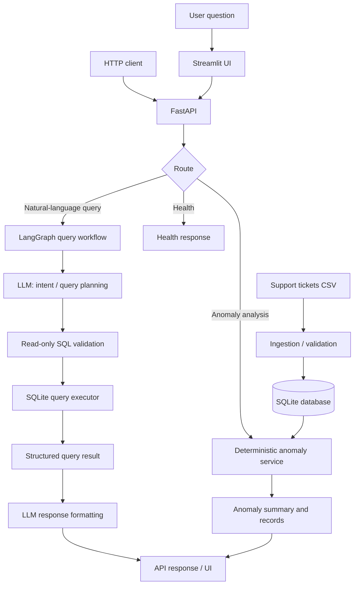

# DOTMappers IT — AI Engineer Assessment

An AI-assisted customer-support analytics application that makes support-ticket data queryable through natural-language questions and identifies operational anomalies. The system combines a deterministic data/query layer with an LLM-powered interpretation layer, a REST API, and a Streamlit interface.

> **Assessment context:** This repository is intended to address the DOTMappers IT AI Engineer assessment: ingest the supplied CSV, answer natural-language questions, detect anomalies, and expose the functionality through an API and UI.

---

## Table of Contents

- [Capabilities](#capabilities)
- [Architecture](#architecture)
- [Request and data flows](#request-and-data-flows)
- [Technology stack](#technology-stack)
- [Dataset](#dataset)
- [Repository layout](#repository-layout)
- [Prerequisites](#prerequisites)
- [Local setup](#local-setup)
- [Running the application](#running-the-application)
- [API overview](#api-overview)
- [Anomaly detection](#anomaly-detection)
- [Validation, security, and reliability](#validation-security-and-reliability)

---

## Capabilities

- **CSV ingestion:** Load support-ticket records into a queryable SQLite database.
- **Natural-language analytics:** Interpret questions and execute read-only database queries through a LangGraph workflow.
- **Anomaly detection:** Identify unusually long resolution times and aged, unresolved high-priority tickets.
- **REST interface:** Expose application functionality through FastAPI endpoints.
- **Interactive UI:** Explore analytics and anomaly results in Streamlit.
- **Date-aware analysis:** Support explicit date ranges where the corresponding API/UI path is enabled; the dataset's dates should be used rather than assuming that “this week” overlaps the data.
- **Structured outputs:** Return query/anomaly results as data that can be rendered by the UI or summarized by the LLM.

## Architecture



### Component responsibilities

| Component | Responsibility |
|---|---|
| CSV ingestion | Reads the source CSV, validates required fields, normalizes values, and creates/updates the local database. |
| SQLite | Local persistence and analytical query execution. |
| FastAPI routes | Validate request parameters, dispatch to services/workflows, and return JSON responses. |
| LangGraph | Orchestrates natural-language query handling as explicit workflow steps. |
| LLM | Interprets user intent and assists with query planning and/or natural-language presentation. It is not the authority for computed counts or anomaly statistics. |
| SQL validation | Restricts generated SQL to read-only, permitted queries before execution. |
| Query executor | Runs validated SQL against SQLite and returns structured rows/metadata. |
| Anomaly service | Computes statistical outliers and overdue-ticket conditions deterministically. |
| Streamlit | Provides a user-facing interface for asking questions and viewing analytics/anomaly results. |

### Design principles

1. **Deterministic computation for facts:** SQL and Python compute counts, averages, date filtering, and anomaly metrics. The LLM should explain results, not invent them.
2. **Read-only query execution:** Natural-language requests must not be able to mutate or delete database contents.
3. **Separation of concerns:** Routes, workflow orchestration, data access, and business logic should remain independently testable.
4. **Local-first operation:** SQLite and a locally run model can support a no-paid-service setup.
5. **Explicit date semantics:** A date-range request should be translated into inclusive start/end boundaries and validated against the dataset's available dates.

## Request and data flows

### 1. Data ingestion

1. The ingestion module locates the configured CSV.
2. It checks required columns and parses timestamps/numeric fields.
3. It creates or populates the SQLite database.
4. API/query services read from the resulting database.

Run the project's ingestion entry point before starting the app if database initialization is not automatically performed by application startup.

### 2. Natural-language analytics

1. A user enters a question in Streamlit or sends it to the query API.
2. The LangGraph workflow receives the question and state.
3. The LLM interprets the request and proposes a structured plan/query.
4. SQL validation rejects unsupported or non-read-only statements.
5. The query executor runs the approved SQL against SQLite.
6. The result is returned as structured data and may be formatted into a concise explanation.
7. The API/UI displays the answer and supporting result rows or aggregates.

### 3. Anomaly analysis

1. The caller supplies an analysis date or date range and any supported threshold.
2. The anomaly service filters the relevant ticket population.
3. Resolution-time outliers are calculated using the configured statistical method (IQR-based bounds in the current implementation described during development).
4. Unresolved high-priority tickets are checked against the overdue-age threshold.
5. The service returns counts, thresholds/bounds, and matching ticket records.

**Important:** “Anomalies in a date range” and “all tickets created up to a reference date” are different populations. The API's selected date parameters determine which interpretation is applied. Confirm the behavior in the current route/service before comparing results.

## Technology stack

| Area | Technology |
|---|---|
| Language | Python |
| API | FastAPI |
| UI | Streamlit |
| Agent/workflow orchestration | LangGraph |
| LLM integration | LangChain-compatible model integration (provider depends on configuration) |
| Database | SQLite |
| Data processing | pandas |
| LLM Models | qwen/qwen3.8-27b (fallback model: openai/gpt-oss-20b) |

The exact package versions should be taken from the repository's `requirements.txt` (or equivalent dependency file). Keep that file as the source of truth.

## Dataset

The Dataset `support_tickets.csv` contains 500 rows. Its schema includes:

| Field | Meaning |
|---|---|
| `ticket_id` | Unique ticket identifier |
| `created_at` | Ticket creation timestamp |
| `category` | Issue category (e.g. Billing, Technical, General) |
| `priority` | Urgency (Low, Medium, High, Critical) |
| `status` | Ticket state (Open, Resolved, Escalated) |
| `response_time_hrs` | Hours until first response |
| `resolution_time_hrs` | Hours until resolution; null for unresolved tickets |
| `agent_id` | Assigned support agent |
| `customer_rating` | Customer rating (1–5; may be null) |
| `issue_summary` | Short free-text issue description |


## Repository layout

The application is organized around API routes, services, workflow/query execution, and a Streamlit UI. Use the actual directory tree in the repository as authoritative; names below describe the intended responsibilities rather than asserting every filename:

```text
.
├── .env.example
├── .gitignore
├── exception.py
├── logger.py
├── README.md
├── requirements.txt
├── start.py
│
├── app/
│   ├── __init__.py
│   ├── config.py
│   │
│   ├── api/
│   │   ├── __init__.py
│   │   ├── main.py
│   │   │
│   │   ├── models/
│   │   │   └── request_models.py
│   │   │
│   │   ├── routes/
│   │   │   ├── anomalies_route.py
│   │   │   ├── health_route.py
│   │   │   └── query_route.py
│   │   │
│   │   └── services/
│   │       ├── detect_anomalies_service.py
│   │       ├── extract_interrupts_service.py
│   │       ├── get_connection_service.py
│   │       ├── json_sanitize_service.py
│   │       └── load_tickets_service.py
│   │
│   ├── db/
│   │   ├── __init__.py
│   │   ├── initialize_db.py
│   │   └── support_tickets.db
│   │
│   ├── llm/
│   │   ├── __init__.py
│   │   ├── graph.py
│   │   ├── llm_service.py
│   │   ├── state.py
│   │   │
│   │   ├── nodes/
│   │   │   ├── __init__.py
│   │   │   ├── anomaly_node.py
│   │   │   ├── chat_node.py
│   │   │   ├── clarification_node.py
│   │   │   ├── executor_node.py
│   │   │   ├── formatter_node.py
│   │   │   ├── intent_node.py
│   │   │   ├── schema_node.py
│   │   │   └── sql_builder_node.py
│   │   │
│   │   └── prompts/
│   │       ├── format_sql_prompt.txt
│   │       └── generate_sql_prompt.txt
│   │
│   └── ui/
│       └── streamlit_app.py
│
└── data/
    └── support_tickets.csv
```

## Prerequisites

- Python 3.14 
- Git.
- GROQ_API_KEY

## Local setup
### 1. Create and activate a virtual environment

**Windows PowerShell**
```bash
python -m venv myenv
myenv/Scripts/activate
```

### 2. Clone the repository

```bash
git clone https://github.com/gyrfalcon55/SupportTickets_Chatbot.git
cd SupportTickets_Chatbot
```


### 3. Install dependencies

```bash
python -m pip install --upgrade pip
pip install -r requirements.txt
```

### 4. Add the dataset

Place `support_tickets.csv` at the location expected by the ingestion configuration. If the project uses a different data path, update the relevant configuration rather than moving files blindly.

### 5. Configure environment variables

Create a local `.env` file if the application uses one. Do not commit secrets.

Example template (rename keys to match the actual settings read by the code):

```dotenv
# Example only — verify names against the application's configuration.
GROQ_API_KEY=
```


If initialization is performed automatically during FastAPI startup, follow that startup path instead and ensure the CSV path is valid.


## Running the application

```bash
python start.py
```

- Streamlit-ui: `http:127.0.0.1:8501`
- API base: `http://127.0.0.1:8000`
- Interactive API docs: `http://127.0.0.1:8000/docs`


## API overview

The assessment requires at least these capabilities:

| Capability | Purpose |
|---|---|
| Health check | Confirms the API process is responding. |
| Natural-language query | Accepts a user question and returns query results/answer. |
| Anomaly detection | Accepts supported date/threshold parameters and returns detected anomalies. |

Inspect the FastAPI route definitions for the exact paths, HTTP methods, request schemas, and response models. Do not assume endpoint names from this overview.

### Example request shapes

These are illustrative payloads; adapt the URL and parameter names to the actual OpenAPI schema exposed at `/docs`.

**Natural-language query**
```json
{
  "question": "How many tickets are currently open?"
}
```

**Anomaly detection**
```json
{
  "start_date": "2024-03-04",
  "end_date": "2024-03-10",
  "overdue_hours": 24
}
```

## Anomaly detection

### Resolution-time outliers

The current development design uses an IQR-style statistical method:

- \(Q_1\): first quartile of valid resolution times.
- \(Q_3\): third quartile.
- \(IQR = Q_3 - Q_1\).
- Lower bound: \(Q_1 - 1.5 \times IQR\).
- Upper bound: \(Q_3 + 1.5 \times IQR\).

Resolution-time values outside the bounds are flagged as statistical outliers. The lower bound can be negative; since resolution durations cannot normally be negative, this is not itself evidence of a negative-duration ticket.

### Overdue unresolved tickets

Unresolved tickets are checked against an age threshold, with priority filtering where configured. The age is calculated relative to the selected reference time/date. The exact priority set and whether the date filter applies to creation date or analysis date must match the service implementation.

### Interpreting results

An anomaly flag is an investigation signal, not proof of a data error or agent fault. Review the ticket, category, priority, and operational context before taking action.

## Validation, security, and reliability

- Validate request bodies, date formats, and threshold ranges at the API boundary.
- Parse LLM output as structured data and handle malformed or incomplete responses.
- Reject SQL that is not read-only; use parameterized values for user-provided filters.
- Keep database access constrained to the intended local database.
- Avoid returning secrets, provider credentials, or unnecessary raw customer text.
- Keep statistical calculations in code rather than asking the LLM to calculate them.
- Provide useful error messages without exposing stack traces to API clients.
- Treat LLM-generated SQL as untrusted input, even when the prompt instructs the model to be safe.


